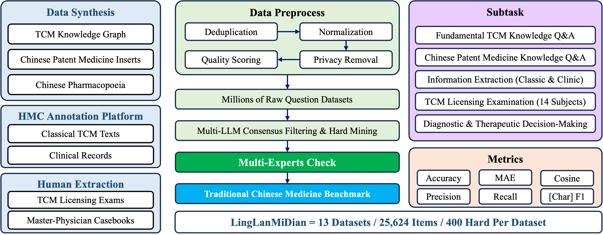
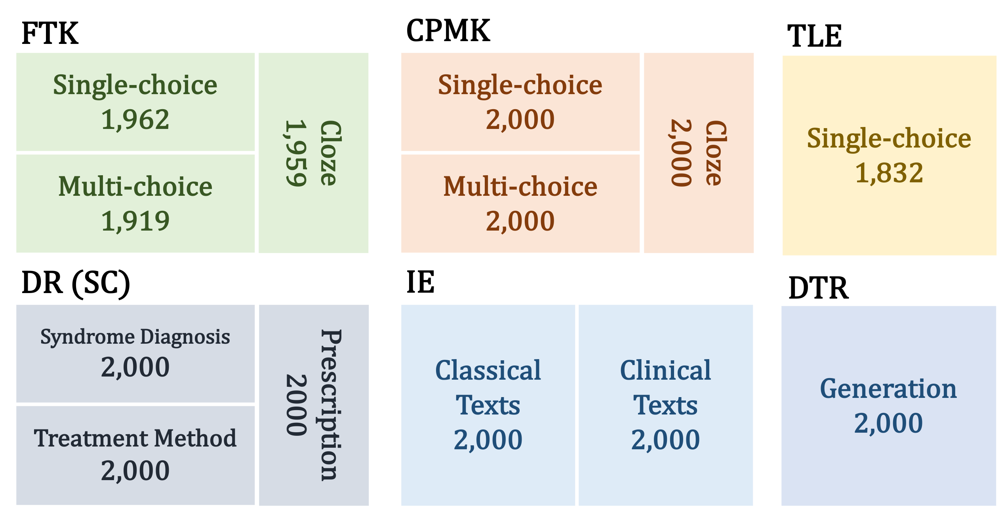
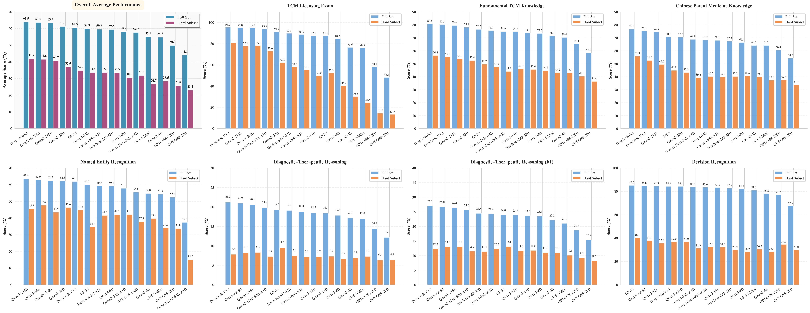

# LingLanMiDian: Systematic Evaluation of LLMs on TCM Knowledge and Clinical Reasoning


<p align="center">
  <a href="https://arxiv.org/abs/2602.01779"><b>Paper</b></a>&nbsp;|&nbsp;
  <a href="http://tcmnlp.com"><b>Leaderboard</b></a>
</p>

<div align=center></div>  

## Introduction

**LingLan** is a large-scale, expert-curated benchmark for evaluating large language models (LLMs) in Traditional Chinese Medicine (TCM). It spans five domains (licensing exam, fundamental knowledge, Chinese patent medicine, information extraction, diagnostic–therapeutic reasoning) with **13 subtasks** and **25,624** instances. Each dataset includes a **400-item** *Hard* subset to probe robustness.

---

## Contents
- [What’s in LingLan](#whats-in-LingLan)
- [Data Statistics](#data-statistics)
- [Evaluation Metrics](#evaluation-metrics)
- [Download](#download)
- [Quick Start](#quick-start)
- [Leaderboards](#leaderboards)
- [Cite LingLan](#cite-LingLan)
- [Related Benchmarks](#related-benchmarks)
- [License & Ethics](#license--ethics)
- [Acknowledgements](#acknowledgements)

---

## What’s in LingLan

<p align="center">
  
</p>

LingLan covers five domains with diverse formats (single-choice, multiple-choice, cloze, multi-label lists, dosage vectors) under a **unified metric system**:
- single-choice: Accuracy  
- multi-choice: instance-level Accuracy; option-level Precision/Recall/F1  
- cloze: **character-level F1**  
- extraction & multi-label: **list-level** Precision/Recall/F1  
- dosage: **cosine similarity** (primary), MAE when prescription overlap is adequate  

LingLan further introduces decision-recognition versions of clinical tasks (single-choice) for clean, reproducible comparisons.

---

## Data Statistics


<p align="center">
  
</p>

- TCM licensing exam: **1,832**  
- Fundamental TCM knowledge (single/multi-choice, cloze): **5,844**  
- Chinese patent medicine (single/multi-choice, cloze): **5,948**  
- Decision recognition (syndrome / treatment / prescription): **2,000 + 2,000 + 2,000**  
- Diagnostic–therapeutic reasoning (syndrome / treatment / prescription / dosage): **2,000**  
- Information extraction — classical: **2,000**  
- Information extraction — EMR: **2,000**  
- **Total:** 9 files, **25,624** items (each dataset includes a 400-item *Hard* subset)

---

## Evaluation Metrics
**Classification:** Accuracy (single-choice; decision recognition)  
**Multi-choice:** Accuracy; option-level Precision/Recall/F1  
**Cloze:** character-level F1  
**Extraction & multi-label clinical tasks:** list-level Precision/Recall/F1  
**Dosage:** cosine similarity (primary); MAE optionally reported when prescription overlap is reasonable

---

## Download

data: [LingLan/data](https://github.com/TCMAI-BJTU/LingLan/tree/main/data)

---

## Quick Start

Refer to [simple_evals](https://github.com/openai/simple-evals) for more details.

Evaluation codes: [tcm_evals](https://github.com/TCMAI-BJTU/TCMBenchmark/tree/main/simple_evals/evals/tcm_evals)

The annotations will not be released until the paper is accepted; therefore, the evaluation code is not currently executable.

---

## Leaderboards

### Concise Leaderboard

<p align="center">
  
</p>

Overall averages (%) on **Full** / **Hard** sets.
(*Hard* reveals a marked gap between current LLMs and expert-level TCM reasoning.)

| **Rank** | **Model**          | **Full** | **Hard** | **Δ (pp)** |
| -------- | ------------------ | -------- | -------- | ---------- |
| 1        | **DeepSeek-R1**    | **51.1** | **31.9** | 19.2       |
| 2        | DeepSeek-V3.1      | 50.9     | 31.2     | 19.7       |
| 3        | Qwen3-235B-A22B    | 50.6     | 30.8     | 19.8       |
| 4        | Qwen3-32B          | 48.4     | 28.8     | 19.6       |
| 5        | GPT-5              | 48.1     | 28.0     | 20.1       |
| 6        | Qwen3-14B          | 47.5     | 27.2     | 20.3       |
| 7        | Qwen3-30B-A3B      | 47.2     | 26.7     | 20.5       |
| 8        | Baichuan-M2-32B    | 47.1     | 26.2     | 20.9       |
| 9        | Qwen3-8B           | 46.2     | 25.4     | 20.8       |
| 10       | Qwen3-4B           | 43.8     | 24.5     | 19.3       |
| 11       | Qwen3-Next-80B-A3B | 44.9     | 22.6     | 22.3       |
| 12       | GPT-5-mini         | 43.9     | 23.3     | 20.6       |
| 13       | GPT-OSS-120B       | 40.7     | 23.1     | 17.6       |
| 14       | GPT-OSS-20B        | 36.1     | 20.8     | 15.3       |


## Cite LingLan

```bibtex
@misc{hua2026linglanmidiansystematicevaluationllms,
      title={LingLanMiDian: Systematic Evaluation of LLMs on TCM Knowledge and Clinical Reasoning}, 
      author={Rui Hua and Yu Wei and Zixin Shu and Kai Chang and Dengying Yan and Jianan Xia and Zeyu Liu and Hui Zhu and Shujie Song and Mingzhong Xiao and Xiaodong Li and Dongmei Jia and Zhuye Gao and Yanyan Meng and Naixuan Zhao and Yu Fu and Haibin Yu and Benman Yu and Yuanyuan Chen and Fei Dong and Zhizhou Meng and Pengcheng Yang and Songxue Zhao and Lijuan Pei and Yunhui Hu and Kan Ding and Jiayuan Duan and Wenmao Yin and Yang Gu and Runshun Zhang and Qiang Zhu and Jian Yu and Jiansheng Li and Baoyan Liu and Wenjia Wang and Xuezhong Zhou},
      year={2026},
      eprint={2602.01779},
      archivePrefix={arXiv},
      primaryClass={cs.AI},
      url={https://arxiv.org/abs/2602.01779}, 
}


@misc{LingLan2026,
  title={LingLanMiDian: Systematic Evaluation of LLMs on TCM Knowledge and Clinical Reasoning},
  author={Ruihua},
  year={2026},
  note={https://github.com/TCMAI-BJTU/LingLan}
}
```


---

## License & Ethics

* Data are curated from de-identified clinical records, classical texts, official exam sources, and structured knowledge resources.

---

## Acknowledgements

We thank the curators, annotators, and domain experts who contributed to dataset construction and verification.