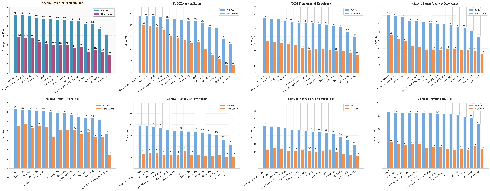

# LingLanMiDian: Systematic Evaluation of LLMs on TCM Knowledge and Clinical Reasoning


<p align="center">
  <a href="#"><b>Paper</b></a>&nbsp;|&nbsp;
  <a href="http://tcmnlp.com"><b>Leaderboard</b></a>
</p>

<div align=center></div>  

## Introduction

**LingLan** is a large-scale, expert-curated benchmark for evaluating large language models (LLMs) in Traditional Chinese Medicine (TCM). It spans five domains (licensing exam, fundamental knowledge, Chinese patent medicine, information extraction, diagnostic–therapeutic reasoning) with **13 subtasks** and **25,624** instances. Each dataset includes a **400-item** *Hard* subset to probe robustness.

---

## Contents
- [What’s in LingLan](#whats-in-LingLan)
- [Data Statistics](#data-statistics)
- [Evaluation Metrics](#evaluation-metrics)
- [Download](#download)
- [Quick Start](#quick-start)
- [Leaderboards](#leaderboards)
- [Cite LingLan](#cite-LingLan)
- [Related Benchmarks](#related-benchmarks)
- [License & Ethics](#license--ethics)
- [Acknowledgements](#acknowledgements)

---

## What’s in LingLan

<p align="center">
  
</p>

LingLan covers five domains with diverse formats (single-choice, multiple-choice, cloze, multi-label lists, dosage vectors) under a **unified metric system**:
- single-choice: Accuracy  
- multi-choice: instance-level Accuracy; option-level Precision/Recall/F1  
- cloze: **character-level F1**  
- extraction & multi-label: **list-level** Precision/Recall/F1  
- dosage: **cosine similarity** (primary), MAE when prescription overlap is adequate  

LingLan further introduces decision-recognition versions of clinical tasks (single-choice) for clean, reproducible comparisons.

---

## Data Statistics


<p align="center">
  
</p>

- TCM licensing exam: **1,832**  
- Fundamental TCM knowledge (single/multi-choice, cloze): **5,844**  
- Chinese patent medicine (single/multi-choice, cloze): **5,948**  
- Decision recognition (syndrome / treatment / prescription): **2,000 + 2,000 + 2,000**  
- Diagnostic–therapeutic reasoning (syndrome / treatment / prescription / dosage): **2,000**  
- Information extraction — classical: **2,000**  
- Information extraction — EMR: **2,000**  
- **Total:** 9 files, **25,624** items (each dataset includes a 400-item *Hard* subset)

---

## Evaluation Metrics
**Classification:** Accuracy (single-choice; decision recognition)  
**Multi-choice:** Accuracy; option-level Precision/Recall/F1  
**Cloze:** character-level F1  
**Extraction & multi-label clinical tasks:** list-level Precision/Recall/F1  
**Dosage:** cosine similarity (primary); MAE optionally reported when prescription overlap is reasonable

---

## Download

Waiting for release.
Huggingface / Modelscope

---

## Quick Start
```bash
git clone https://github.com/TCMAI-BJTU/LingLan
cd LingLan
pip install -r requirements.txt

# Evaluate a model
python eval/run_eval.py --model Qwen3-32B --tasks TLE
````

---

## Leaderboards

### Concise Leaderboard

<p align="center">
  
</p>

Overall averages (%) on **Full** / **Hard** sets.
(*Hard* reveals a marked gap between current LLMs and expert-level TCM reasoning.)

| Rank | Model                |     Full |     Hard | Δ (pp) |
| ---- | -------------------- | -------: | -------: | -----: |
| 1    | **DeepSeek-R1**      | **58.3** | **37.6** |   20.7 |
| 2    | DeepSeek-V3.1-Think  |     57.9 |     37.0 |   20.9 |
| 3    | Qwen3-235B-A22B    |     57.8 |     36.5 |   21.3 |
| 4    | Qwen3-32B            |     55.6 |     34.6 |   21.0 |
| 5    | Qwen3-14B            |     54.5 |     32.4 |   22.1 |
| 6    | Baichuan-M2-32B      |     53.7 |     30.9 |   22.8 |
| 7    | Qwen3-8B             |     53.0 |     30.3 |   22.7 |
| 8    | Qwen3-4B             |     50.2 |     28.8 |   21.4 |
| 9    | Qwen3-Next-80B-A3B |     50.8 |     26.3 |   24.5 |
| 10   | GPT-OSS-120B         |     47.0 |     27.8 |   19.2 |
| 11   | GPT-OSS-20B          |     41.9 |     24.5 |   17.4 |


## Cite LingLan

```bibtex
@misc{LingLan2025,
  title={LingLan: Ultimate Traditional Chinese Medicine Benchmark},
  author={Ruihua},
  year={2025},
  note={https://github.com/TCMAI-BJTU/LingLan}
}
```

---

## License & Ethics

* Data are curated from de-identified clinical records, classical texts, official exam sources, and structured knowledge resources.
* See **LICENSE** and **ETHICS.md** for usage terms and citation requirements.

---

## Acknowledgements

We thank the curators, annotators, and domain experts who contributed to dataset construction and verification.
